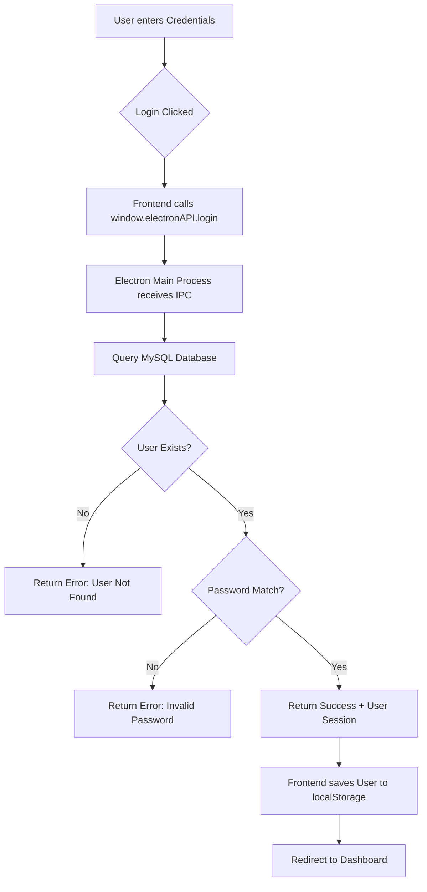
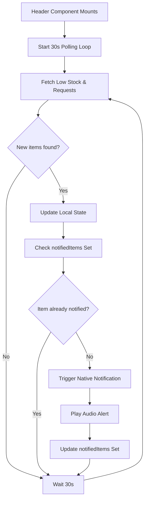
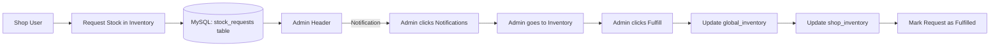
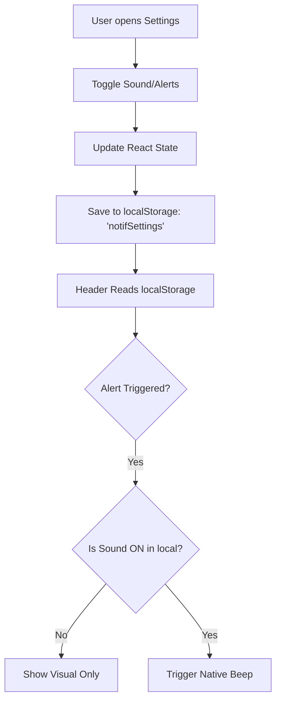
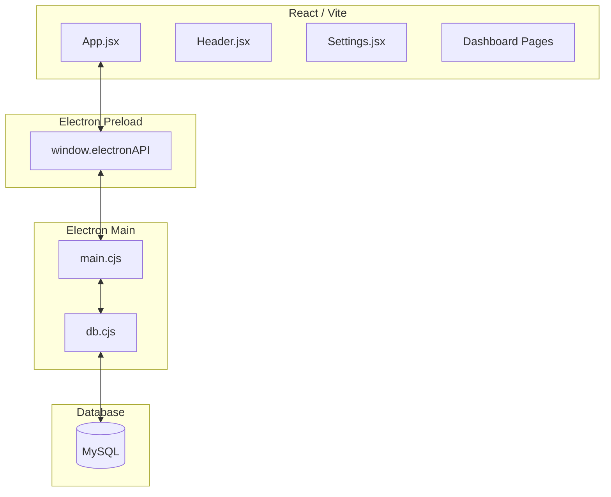

# Velmess Kitchen OS Flowchart

This document outlines the core logical flows of the Velmess Kitchen OS application, including authentication, real-time notifications, and system settings.

## 1. Authentication Flow
This diagram illustrates the login process from the frontend to the MySQL database via Electron IPC handlers.

## 2. Real-Time Notification & Alert Flow
This flow describes how the system polls for low stock alerts and requests, keeping the user informed with visual, audio, and native alerts.

## 3. Stock Request & Fulfillment Flow (Admin/Shop)
Describes the interaction between a Shop requesting stock and an Admin fulfilling it.

## 4. Settings & Configuration Persistence
How user preferences (Theme, Sound, Alerts) are managed.

## 5. System Architecture

