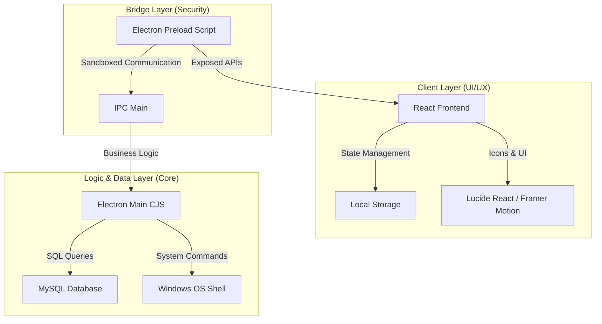
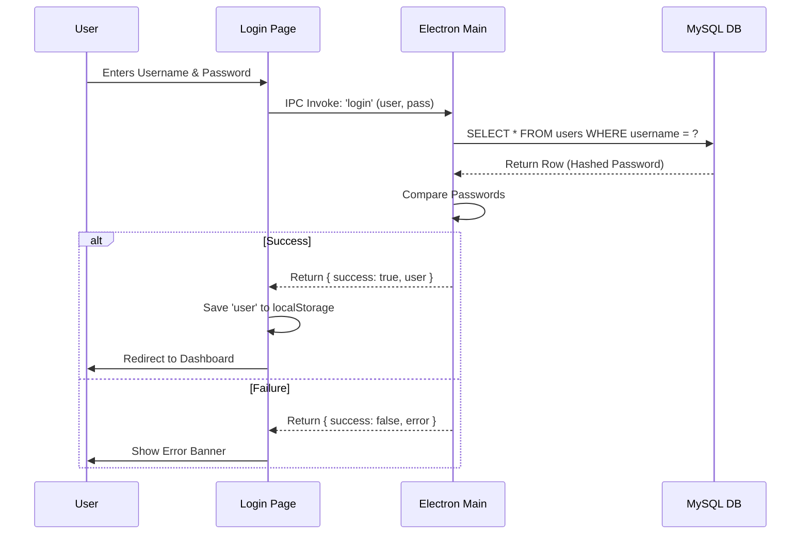
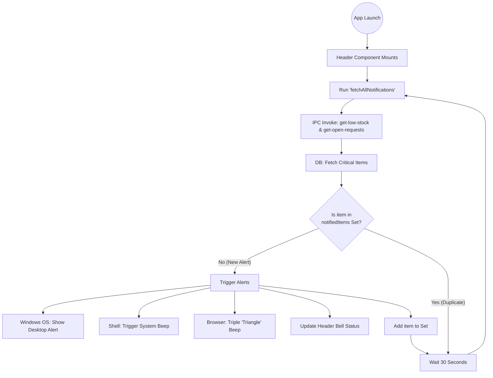
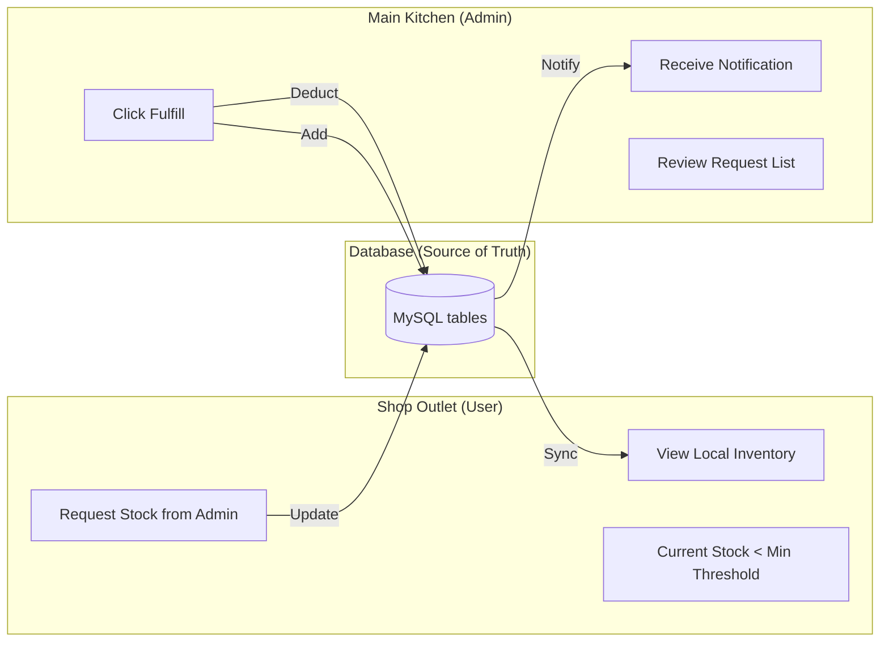

# Velmess Smart Control - Complete Application Logic Flow

This document provides a detailed technical and functional map of how the **Velmess Smart Control** ecosystem operates, from the database to the user interface.

---

## 1. High-Level System Architecture
The application follows a **three-tier architecture** tailored for desktop performance and local data security.

---

## 2. Core Operational Flows

### A. Authentication & Session Management
How users enter the system and how their identity is maintained.

### B. Real-Time Notification Engine
The logic behind the automatic stock monitoring system.

### C. Inventory & Stock Request Lifecycle
The loop between Shop Outlet and Main Kitchen (Admin).

---

## 3. Data Integrity & Security Rules

| Feature | Implementation Logic |
| :--- | :--- |
| **Password Security** | Passwords are stored in the database. (Future: BCrypt Hashing enabled). |
| **Role Access** | `isAdmin` checks are performed in the Frontend and Backend to prevent Shop users from seeing fulfilling stock requests. |
| **System Privacy** | Developer Console (DevTools) is disabled by default for users. |
| **Sound Logic** | Bypasses "User Gesture" requirements via `autoplayPolicy` in Electron. |

---

## 4. UI Design System
*   **Theme**: Dual Mode (Light/Dark) managed via `ThemeContext`.
*   **Colors**: 
    *   Deep Navy / Slate (Primary)
    *   Emerald / Tech Blue (Secondary)
    *   Crimson Red (Alerts)
*   **Animations**: `framer-motion` used for smooth dropdowns and modal transitions.

---

### **Summary of User Roles**
1.  **Admin**: Can create products, manage all shops, fulfill stock requests, and view global analytics.
2.  **Shop Owner**: Can view local inventory, make orders, and request stock from the Main Kitchen.
